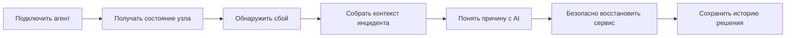

# Trace

## Домашние серверы заслуживают control plane уровня production

[trace.solen.one](https://trace.solen.one)

Trace превращает домашний сервер в управляемый узел: пользователь подключает агент одной командой, видит состояние инфраструктуры в web dashboard и восстанавливает сервисы без SSH. Продукт объединяет мониторинг, incident response, безопасные действия и AI-анализ в одном интерфейсе.

## Почему сейчас

Self-hosting перестал быть нишей для нескольких энтузиастов. Люди хранят дома данные, поднимают VPN, медиасерверы, базы данных, ботов, личные приложения и AI-инструменты. В момент сбоя их опыт выглядит одинаково: уведомление приходит слишком поздно, причина скрыта в логах, а восстановление требует терминала и памяти о том, как устроен конкретный сервер.

Готовые enterprise-платформы сложны и дороги для домашней инфраструктуры. Простые uptime-сервисы показывают, что сервис недоступен, но не дают контекст и не помогают исправить проблему. Trace занимает пространство между ними: сервис остается легким для владельца homelab, но дает ему рабочий цикл эксплуатации.

## Продуктовый цикл

Trace не останавливается на графике загрузки CPU. Он показывает, какой сервис упал, с каким exit code, что происходило до сбоя, как сработал watchdog и какое действие имеет смысл выполнить дальше. Пользователь может перезапустить сервис, запустить диагностику, отключить проблемную политику или откатить конфигурацию прямо из incident view.

## Что уже работает

### Agent-first onboarding

Пользователь создает одноразовый pairing code и получает готовую install-команду. Агент устанавливается как системный сервис, связывается с аккаунтом и начинает передавать состояние узла. Это снижает порог входа до привычного сценария: скопировать одну команду в терминал.

### Полная картина состояния

Trace показывает CPU, память, диски, аптайм, процессы, сервисы, логи, сеть, открытые порты, публичный IP и DNS. Пользователь видит сервер как единый объект, а не как набор несвязанных вкладок и команд.

### Watchdog и incident response

Агент следит за критичными процессами и системными сервисами на Linux и macOS. При падении он фиксирует состояние, соблюдает restart-политику и отправляет событие в control plane. Trace открывает инцидент с таймлайном, severity, историей действий и метриками MTTR.

### AI Incident Analyst

AI получает контекст инцидента: сигналы watchdog, состояние процесса, логи и системные метрики. В ответ оператор видит краткое описание ситуации, вероятную причину, оценку серьезности и следующий безопасный шаг. Это особенно важно для пользователей, которые управляют инфраструктурой в одиночку и не держат в голове каждый сервис.

### Безопасное удаленное управление

Trace дает доступ к преднастроенным задачам и service actions, а не к произвольному shell. Агент запускает только разрешенные команды, ограничивает окружение и сохраняет аудит. Пользователь получает удобство удаленного восстановления без создания открытого терминала в браузере.

### Надежность, которая важна дома

Агент буферизует критичные данные при потере интернета и отправляет накопленный пакет после восстановления связи. Привязка выполняется через одноразовый код, транспорт поддерживает mTLS, а обновление агента проверяет контрольную сумму и подпись до атомарной замены бинарника.

## Для кого

Trace создан для владельцев homelab и self-hosted-инфраструктуры:

- создателей, которые держат личные сервисы и ботов;
- разработчиков, которые используют домашний сервер как среду для проектов;
- небольших команд с несколькими узлами вне облака;
- людей, которым важны контроль над данными и независимость от SaaS-платформ.

Пользователь начинает с одного сервера, но интерфейс и модель данных рассчитаны на рост до нескольких узлов, сервисов и операторов.

## Модель развития

Trace строится как micro SaaS с понятным расширением ценности.

| План | Ценность |
| --- | --- |
| Free | Наблюдаемость одного сервера, базовые метрики, alerts и incident list |
| Plus | Несколько узлов, remote tasks, service actions, AI-анализ, управление конфигурацией и Telegram-уведомления |

Free-план дает пользователю повод установить агент и доверить продукту один сервер. Plus монетизирует те функции, которые экономят время в момент реального инцидента: действия, автоматизация, объяснение причин и уведомления.

## Почему Trace может вырасти

Trace соединяет три слоя, которые обычно существуют отдельно:

1. Локальный агент понимает состояние конкретной машины и ее сервисов.
2. Control plane превращает телеметрию в историю, инциденты и управляемые действия.
3. AI переводит технический контекст в понятное решение для человека.

Эта связка формирует основу для следующих направлений: library готовых интеграций, шаблоны watchdog-политик, backup workflows, совместная работа операторов, managed relay для внешней доступности и marketplace автоматизаций.

## Статус MVP

Продукт уже включает регистрацию, подключение агента, dashboard, сервисный watchdog, incidents, live updates, AI-анализ, remote tasks, audit log, тарифы Free/Plus и профиль пользователя. Telegram-уведомления вынесены в отдельный worker, поэтому их можно запускать независимо от основного control plane.

Trace показывает, как домашняя инфраструктура может стать предсказуемой и управляемой, сохранив главное преимущество self-hosting: контроль остается у владельца.

## Для разработки

- [Документация агента](agent/README.md)
- [Документация backend](backend/README.md)
- [Документация frontend](frontend/README.md)
