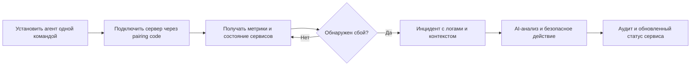

# Trace

> Control plane для домашних серверов и self-hosted-инфраструктуры.

Trace помогает владельцу домашнего сервера видеть состояние инфраструктуры, реагировать на сбои и управлять сервисами из браузера. Пользователь подключает агент одной командой, после чего получает dashboard с метриками, сервисами, логами, сетевой диагностикой и историей инцидентов.

## Проблема

Домашний сервер редко выглядит как один сервис. На нем живут медиа-сервер, VPN, боты, база данных, reverse proxy, backup-задачи и личные приложения. Когда один из процессов падает, владелец узнает об этом слишком поздно или подключается по SSH, чтобы вручную искать причину.

Обычный мониторинг показывает график. Trace связывает сигнал с действием: фиксирует падение сервиса, собирает контекст, создает инцидент и дает оператору безопасные способы восстановления.

## Что делает Trace

### Единая панель состояния

Dashboard собирает главное состояние каждого узла: загрузку CPU и памяти, диски, аптайм, сетевой трафик, открытые порты, публичный IP, DNS-проверки, процессы и сервисы. Пользователь видит, какой сервер доступен, какой сервис требует внимания и какая конфигурация еще не применена агентом.

### Контроль сервисов и Watchdog

Агент работает рядом с сервером и интегрируется с системными службами Linux и macOS. Он отслеживает критичные процессы, сохраняет exit code, соблюдает restart-политику и отправляет события в Trace. Для каждого сервиса можно настроить правила перезапуска и безопасный remote control.

### Инциденты вместо разрозненных алертов

Trace превращает события watchdog в полноценный инцидент: с таймлайном, затронутым сервисом, severity, историей действий и метриками MTTR. Из карточки инцидента можно перезапустить сервис, отключить watchdog, запустить диагностику или откатить конфигурацию. Каждое действие остается в audit log.

### AI Incident Analyst

AI-анализатор собирает доступный контекст инцидента: сообщения watchdog, состояние процесса, системные и сетевые метрики. Затем он формирует краткое объяснение вероятной причины, оценивает серьезность проблемы и предлагает следующий безопасный шаг. Оператор получает понятный план, а не набор сырых логов.

### Сеть и доступность

Trace проверяет соответствие публичного IP и DNS-записей, доступность выбранных портов, входящий и исходящий трафик, а также результаты легковесных speed tests. Это помогает быстро понять, связан ли сбой с приложением, маршрутизацией или провайдером.

### Безопасные удаленные действия

Вместо произвольного shell-доступа Trace использует заранее разрешенные задачи и service actions. Агент запускает только allowlisted-команды, ограничивает окружение и размер вывода, записывает результат и аудит. Такой подход дает удобство удаленного управления без превращения dashboard в открытый терминал.

## Как это выглядит для пользователя

1. В dashboard пользователь нажимает **Add node**.
2. Trace создает одноразовый pairing code и готовую команду установки.
3. Агент устанавливается как системный сервис, связывается с аккаунтом и начинает отправлять состояние.
4. При сбое watchdog открывает инцидент. Пользователь видит контекст и восстанавливает сервис из браузера.

## Надежность и приватность

- Привязка агента выполняется через одноразовый pairing code.
- Канал между агентом и сервером поддерживает mTLS.
- Агент продолжает собирать критичные события при потере сети и выгружает накопленный буфер после восстановления связи.
- Конфигурации и удаленные действия привязаны к конкретному аккаунту и серверу.
- Удаленные задачи проходят через allowlist, а важные операции попадают в audit log.
- Агент может проверять обновления, верифицировать SHA-256 и Ed25519-подпись, затем выполнять атомарную замену бинарника.

## Продуктовая модель

Trace развивается как micro SaaS.

| План | Для кого | Возможности |
| --- | --- | --- |
| Free | Один домашний сервер | Базовый dashboard, метрики, alerts и incident list |
| Plus | Homelab и несколько сервисов | До 10 узлов, remote tasks, service actions, AI-анализ, управление конфигурацией и Telegram-уведомления |

Такой подход позволяет начать с наблюдаемости, а затем подключать функции, которые действительно меняют состояние инфраструктуры.

## Из чего состоит продукт

Trace разделен на три понятные части:

- **Agent** устанавливается на домашний сервер, собирает состояние и выполняет разрешенные операции.
- **Control plane** хранит состояние, формирует инциденты, управляет доступом и доставляет команды агентам.
- **Web dashboard** дает пользователю понятный интерфейс для наблюдения, анализа и восстановления.

В production-режиме данные сохраняются в постоянном хранилище, а оперативное присутствие агентов отслеживается отдельно. Внутренние детали изолированы за API, поэтому продукт можно развивать без изменения сценария пользователя.

## Готово в MVP

- Регистрация, вход и аккаунт с тарифом.
- Подключение агента через pairing code и готовую install-команду.
- Список серверов, detail dashboard, DNS, сеть, логи, процессы и сервисы.
- Watchdog, service restart и incident lifecycle.
- Incident list, real-time обновления, метрики MTTR и частоты сбоев.
- AI Incident Analyst.
- Remote tasks, diagnostics, audit log, rollback конфигурации.
- Offline buffer, mTLS-подключение и signature-verified self-update агента.
- Страница профиля, тарифы Free/Plus и привязка Telegram для уведомлений.

## Границы текущего MVP

Trace сознательно не дает полный интерактивный shell в браузере. Remote shell остается выключенным до появления отдельного streaming-протокола и более строгой sandbox-модели. Telegram-воркер разворачивается отдельно от основного control plane, поэтому уведомления можно включать независимо от основного сервиса.

## Почему Trace важен

Self-hosted-инфраструктура стала доступнее, но ее эксплуатация осталась ручной. Trace дает домашним серверам практики, которые обычно доступны только командам с полноценной SRE-инфраструктурой: наблюдаемость, инциденты, контекст, безопасные действия и история решений.

Проект доступен на [trace.solen.one](https://trace.solen.one).

## Документация для разработки

- [Agent](agent/README.md)
- [Backend](backend/README.md)
- [Frontend](frontend/README.md)
